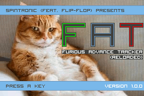

# 

FAT is a Gameboy Advance tracker.
This software has been coded with C langage.
If you wish to compile FAT by yourself, then follow the below steps.
These instructions are only available for a Linux machine : but I assume you use windows because you are expert with it. You should be able to translate all the informations below :)

## 1. Download package

Before any operations, you have to download all the stuff :
http://brouillard.me/shared/howto_FAT_install.zip

## 2. Then follow this procedure.

PRE : Install Wine on your system. 

0. Unzip the "howto_FAT_install.zip"
```
    unzip howto_FAT_install.zip
    cd howto_FAT_install/
   ``` 
1. Copy the libraries directories in a cool space. Mine is "/home/cyril/Coding/GBA/"
```
    mkdir /home/cyril/Coding/GBA
    cp -R ham libhel /home/cyril/Coding/GBA/
```
2. Then allow some programs in theses directories to execute (such as compiler and so)
```
    cd /home/cyril/Coding/GBA/ham
    chmod +x tools/d2u-u2d tools/linux/elf_align tools/linux/gfx2gba tools/linux/interflip tools/linux/mb tools/linux/vba tools/linux/wav2gba
    chmod +x system/lnkscript*
    chmod +x gcc-arm/bin/*
    chmod +x gcc-arm/arm-thumb-elf/bin/*
```
3. Configure your bashrc (or zshrc or whatever)
```
    echo "export HAMDIR=/home/cyril/Coding/GBA/ham" >> ~/.bashrc
    source ~/.bashrc
```
4. Copy the old libstdc++ shared lib on your disk
```
    cd howto_FAT_install/
    cp libstdc++-libc6.1-1.so.2 /usr/lib/
    sudo ldconfig
```
5. Clone the FAT's code and let's make a compilation test !
```
    git clone https://github.com/cbrouillard/furiousadvancetracker.git
    cd furiousadvancetracker
    make release // or "make run" if you already have VisualBoyAdvance installed on your system.
```

If there are errors at this point, please verify that all developers packets had been installed on your system (like gcc, cpp, make and others). Error message should be clear enough. You can also use Google.

Have fun !
